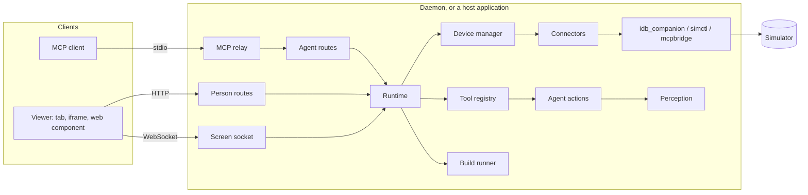

# Architecture

## The parts

| Package | Does |
|---|---|
| `scope`, `seams`, `host_copy` | What devices are grouped by, the few things a host decides, and the words it uses |
| `config` | Every setting once (`schema`), and the TOML file, environment and writer a standalone install reads |
| `storage`, `platform` | Private folders and device claims; the only modules that run `xcrun`, `simctl` and processes |
| `connectors` | The capability model, the registry, and the `idb`, `simctl` and `mcpbridge` connectors |
| `perception` | The element tree, snapshots, diffs, waits, settling, and the token estimate |
| `core` | Devices and their lifetime, frames, events, tickets, a person's input, agent actions, and `Runtime` |
| `tools`, `build` | The agent tools, and building and testing |
| `server` | Router factories, security middleware, log redaction, the viewer's pages |
| `daemon` | The standalone app: tokens -- a host token per application sharing it -- codes, leases, policy, lifecycle |
| `mcp` | The standard-library relay and `sim-mirror mcp` |
| `doctor`, `cli` | The checks, and the command line |
| `api` | The only surface a host imports; `hosting` is how a host shares the daemon instead of embedding |
| `testing` | The fakes, the device rig and the guards, shipped for hosts' tests |

The viewer (`viewer/`) is TypeScript: a `createViewer` function, a transport interface, and the `<sim-mirror>` element
built on them; its standalone page is built into the Python package.

## Seams

`core/runtime.py` is the one composition root. Everything a host decides comes in through a protocol in `seams.py` --
`ConfigSource`, `StateStore`, `Policy`, `Authenticator`, `UsageProbe`, `DeviceMemory` -- and every message's wording
through `HostCopy`. The standalone daemon is just one set of implementations: TOML settings, Application Support
folders, a policy from settings, tokens, and leases renewed by `sim-mirror mcp`.

## Flows

**A person watching.** The viewer's transport starts the scope's device (`POST`), getting its status and a one-shot
ticket; opens the screen socket with it; exchanges hellos to pick an encoding; then draws binary frames and applies
status events, and sends whitelisted input.

**An agent acting.** The relay hands `tools/call` to the agent routes; the authenticator names the caller and its scope;
`Runtime.call` checks the scope may use tools now, and the tool registry runs the tool. `sim_act` announces each gesture
on the device's event bus -- which every screen socket forwards, so viewers draw the cursor -- waits the cursor lead
while someone watches, plays it through the connector, waits, and answers with a snapshot diff.

**A setting changing.** The writer edits `config.toml`, the daemon is told to reload, and `Runtime.reconcile` ends what
is now off and moves devices whose connector changed -- before the command returns.

## Rules the checks keep

- **Containment**: `xcrun`, `simctl`, `xcodebuild`, `xcresulttool` and `idb_companion` are named only by the modules that
  run them (`scripts/check_containment.py`).
- **Host-neutral**: no host application's vocabulary anywhere (`scripts/check_host_neutral.py`).
- **One protocol source**: `protocol/v1` generates the Python and TypeScript types; contract tests validate every
  message the server builds.
- **Generated references**: tools, configuration, CLI, protocol constants and compatibility pages come from the code.
- **Tests never touch a real simulator**, and every file keeps 98% coverage or more.
