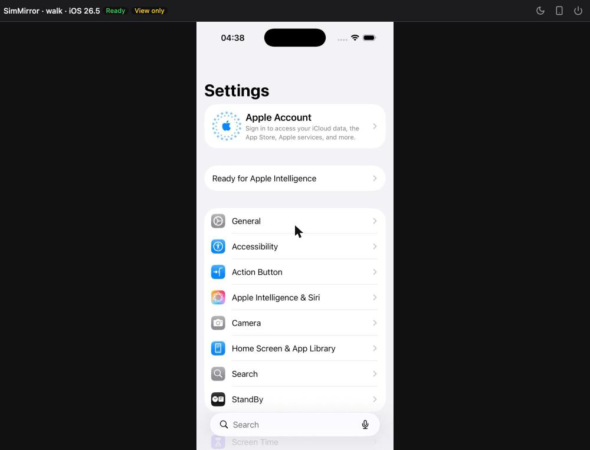

# Connectors

A connector is how SimMirror reaches a device: it says what it can do there, and hands over the parts to drive it.
Booting, installing and launching are simctl's whichever connector is in use; a connector owns the screen, input and
the element tree.

## Capabilities

| Capability | Means |
|---|---|
| `lifecycle` | Boot, shut down and restart devices |
| `device_list` | List this Mac's simulators |
| `appearance` | Switch light and dark |
| `open_url` | Open a URL on the device |
| `app_install`, `app_launch` | Install a built app; launch and terminate apps |
| `logs` | Read the device's log |
| `screenshot` | A JPEG of the screen |
| `stream_jpeg`, `stream_h264` | The live screen as JPEG frames or as H.264 |
| `input_touch`, `input_button`, `input_key`, `input_text` | Touches and gestures, hardware buttons, keys, text |
| `element_tree` | What is on screen, as an accessibility tree |
| `build_preview` | Reserved for build integrations |

The viewer offers only the controls the connector can serve, and an agent is offered only the tools it can: without
`input_touch` there is no `sim_act`, without `element_tree` no `sim_snapshot`. See the
[tool reference](reference/tools.md) for what each tool needs.

## Built in

| Connector | Needs | Can do |
|---|---|---|
| `idb` | idb_companion 1.5, from Homebrew or `connectors.idb.companion_path` | Everything above except `build_preview`: JPEG and H.264, all input, the element tree |
| `simctl` | Only Xcode | View-only: JPEG at up to 4 frames a second, lifecycle, device list, appearance, open URL, install, launch, logs, screenshots; its screen is [read from its pixels](screen-understanding.md#read-from-pixels) while `perception.ocr` is on |
| `mcpbridge` | Xcode 27, and Xcode's approval | Everything simctl can, and the element tree, read through Xcode's UI hierarchy; no input |

The idb connector starts one idb_companion per booted device, in a process group of its own, serving on a unix socket
in the run folder -- no TCP port -- and ends it when the device is let go. A companion a crashed SimMirror left behind is
ended the next time it starts, and never one another host started.

### mcpbridge

Xcode 27 ships `mcpbridge`, which lets an agent use Xcode's tools. The mcpbridge connector shows the screen as simctl
does and reads it through one of those tools: a capture of the device's UI hierarchy. So an agent can take snapshots on
a Mac without idb_companion. What was measured on Xcode 27.0 with an iOS 27.0 simulator (2026-09-16):

- **It needs no window.** mcpbridge reaches Xcode's tool service, which runs without a window and starts when it is not
  running; Xcode itself is never opened. It follows `device.developer_dir`, so it works while `xcode-select` names an
  older Xcode.
- **Xcode approves it first.** Xcode lets an agent use its tools once the agent has opened a project through them,
  and asks you then if it is set to ask. Run `sim-mirror xcode approve` in a project's folder, or give it a
  `.xcodeproj` or `.xcworkspace`: it opens that project through Xcode's tools and closes it again. The approval is
  for the program that runs mcpbridge -- SimMirror's own Python -- and outlasts Xcode restarting.
- **A read takes 0.2 to 0.9 seconds** once a session is open, and opening one 0.05 to 1.8. A simulator can be in one
  session at a time, so SimMirror ends its session a minute after the last read and when the device is let go; an
  agent working in Xcode can use the simulator in between. A session SimMirror left behind is taken back; another
  agent's is left alone, and SimMirror says whose it is.
- **It does not touch.** A tap through Xcode's tools answered after 3.3 seconds and a button press after 5.7, since
  each waits for the screen to settle and captures it -- too slow for a person's hand or an agent's steps -- so it
  offers no input, and agents are not offered `sim_act`.

Xcode 26.6 also has an `mcpbridge`, but it reaches only an Xcode that is open, and was not measured; SimMirror counts
only Xcode 27 and later.

## Choosing one

`connectors.preferred`:

- **`auto`** (the default) tries `idb`, then `simctl`, and uses the first that can be used here. When it falls back it
  says why -- in the viewer, in `sim-mirror doctor`, and in the refusal of a tool that needs more -- so a Mac without
  idb_companion still shows the screen and says what to install to touch it.
- **A connector's name** uses that one, or refuses with its reasons. It never quietly uses another. `mcpbridge` is
  used only this way.

Changing it takes effect at once: a running device is brought back on the new connector.

## Merging Xcode's hierarchy

idb_companion's accessibility tree leaves out a web page's text and links, a widget's text and the status bar; Xcode
27's UI hierarchy has them. With **`connectors.mcpbridge.merge`** on, a device idb drives is read both ways for every
snapshot: idb's tree whole, and from Xcode's only what idb does not already say in the same place, whatever each calls
it. The added elements get refs like any other, and a tap on one goes through idb.

Measured on iOS 27.0 (2026-09-16): Safari showing example.com went from 5 elements to 8 -- its heading, its text and
its **Learn more** link, which an agent then tapped -- and the home screen from 13 to 19, with a widget's text, the
page indicator, the time and Wi-Fi. Settings, a SwiftUI form, an alert and the keyboard came out the same as idb alone.
Each snapshot takes 0.2 to 0.9 seconds longer, so it is off by default. When Xcode cannot read the screen -- not
approved, another agent's session -- the snapshot still comes from idb, and says why.

## More connectors

A package registers a connector under the `sim_mirror.connectors` entry point, and SimMirror finds it when it starts;
`sim-mirror version` and `sim-mirror doctor` list it. Choose it by name in `connectors.preferred`.

Planned: a native Swift helper (faster frames and input without idb_companion), real iPhones
(first without signing, then WebDriverAgent), and Android emulators. Write your own with the
[connector guide](contributing/connector-guide.md).
