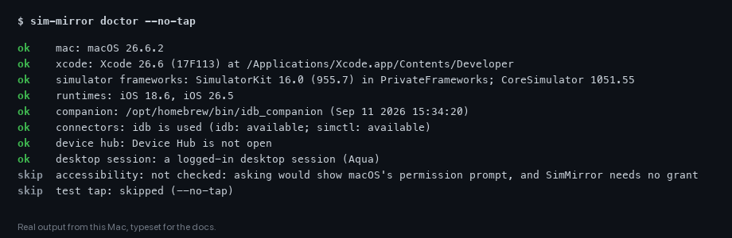

# The doctor

```sh
sim-mirror doctor
```

checks this Mac for what SimMirror needs, in the order you would fix things, and ends with a real tap. Nothing it does
installs, selects or changes anything; every problem comes with a fix.



## The checks

| Check | Looks at |
|---|---|
| `mac` | That this is a Mac; on anything else the rest are skipped |
| `xcode` | The Xcode SimMirror's programs run with -- `device.developer_dir`, else `DEVELOPER_DIR`, else `xcode-select -p` -- what named it, its version, and the Xcode the rest of the Mac uses when that is another |
| `simulator frameworks` | Where `SimulatorKit.framework` is (Xcode 27 moved it to `Contents/SharedFrameworks`) and the machine's `CoreSimulator.framework` |
| `runtimes` | The iOS runtimes installed |
| `companion` | idb_companion: where it is, its version, and the Xcode it starts with |
| `running companions` | Each companion already running, and the Xcode it runs with: a companion keeps the one it started with |
| `connectors` | Which connectors can be used here, and which one `connectors.preferred` gives |
| `device hub` | Whether Xcode 27's Device Hub is running, which can swallow input |
| `desktop session` | A logged-in graphical session, which simulators need |
| `accessibility` | Reported as not checked: reading it would show macOS's permission prompt |
| `test tap` | A real tap on a simulator |

## Results

Each check is `ok`, `warn` (SimMirror works, with less -- such as view-only without idb_companion), `fail` (it does
not work until fixed) or `skip` (not checked, and why). The command exits **0** when all is well, **2** when something
only warned and **1** when something failed.

## The test tap

Everything else can look fine while touches go nowhere. So the doctor does what an agent would: it uses `--device
UDID`, else a booted simulator, else one of its own; launches Settings fresh; taps **General**; and waits for General's
page. If the screen did not change, input was swallowed, and the doctor says how to fix it -- usually Xcode 27's Device
Hub (see [Troubleshooting](troubleshooting.md#taps-do-nothing)).

`--no-tap` skips it.

## For a report

```sh
sim-mirror doctor --json
```

prints the same results as JSON. Attach it to a
[compatibility report](https://github.com/AndrewKochulab/sim-mirror/issues/new?template=compatibility-report.yml) or a
bug report.
