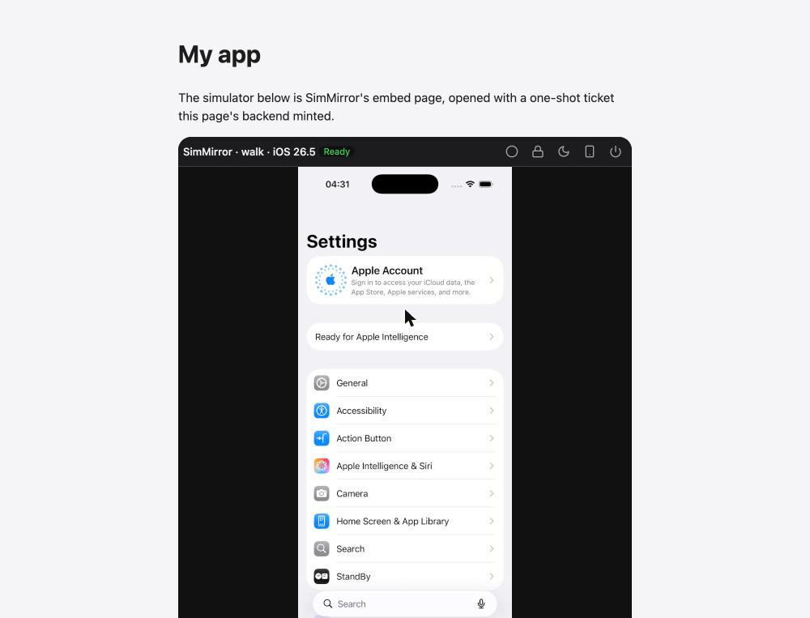

# The viewer in an iframe

The simplest way to put a scope's simulator in your own web page: frame the daemon's embed page.

```html
<iframe src="http://127.0.0.1:7466/embed/demo#ticket=…" title="iOS Simulator"></iframe>
```

## 1. Let your page frame it

The daemon tells browsers which pages may frame it (`Content-Security-Policy: frame-ancestors`): itself, and the
origins in `security.frame_ancestors`.

```toml
# config.toml (sim-mirror config path)
[security]
frame_ancestors = ["https://my-app.example"]
```

## 2. Mint a ticket on your backend

Your backend keeps a token and never sends it to the page. For each page view it asks the daemon for a one-shot embed
ticket:

```sh
sim-mirror token create --kind viewer --scope demo --label "my app"    # once; printed only this once
```

```http
POST /api/v1/scopes/demo/embed-tickets
Authorization: Bearer <viewer token for demo>
```

```json
{"ok": true, "data": {"url": "/embed/demo#ticket=…", "expires_in_s": 60}}
```

It hands the page the daemon's address and that `url`. [examples/embed-host](../../examples/embed-host/) is a complete
backend in one standard-library file.

## 3. Frame it

```js
const { embed_url } = await (await fetch('/api/embed-ticket', { method: 'POST' })).json()
document.querySelector('iframe').src = embed_url
```

## What happens in the frame

1. The embed page reads the ticket from the URL's **fragment** -- which a browser never sends to a server, so it
   reaches no log -- and removes it from the address.
2. It spends the ticket at `POST /api/v1/auth/exchange` for a viewer token that lives in the page's memory only.
3. It starts the scope's device and opens its screen socket.

A ticket works once, within a minute. Reloading the frame alone asks you to reload the page that shows it, which mints
a new one.



## Limits and choices

- An origin not in `frame_ancestors` gets a blank frame, and the browser says why in its console.
- H.264 needs a secure page (HTTPS, or `http://127.0.0.1`/`localhost`); elsewhere the viewer uses JPEG.
- For more control -- your own layout, theming, events -- use the [web component](web-component.md) instead.
- See [Security](../security.md) for what the tickets and tokens protect.
