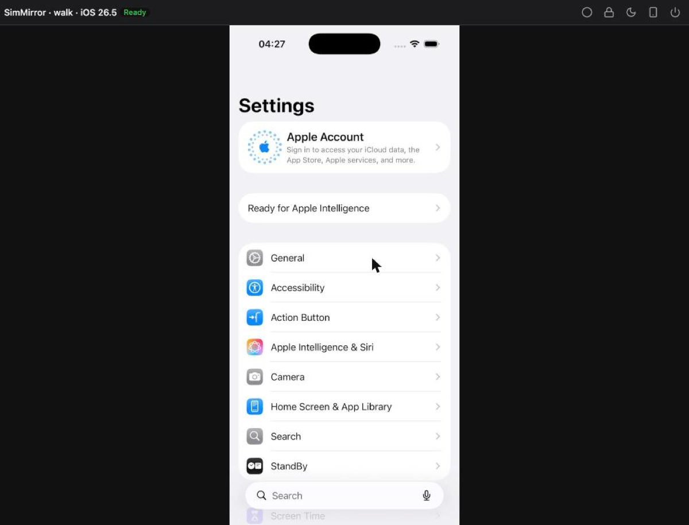

# Getting started

From nothing to an AI agent tapping through an app while you watch.



## What you need

- An Apple Silicon Mac with Xcode 26 or later and an iOS runtime installed.
- [uv](https://docs.astral.sh/uv/).
- For touching the screen, idb_companion: `brew install facebook/fb/idb-companion`. Without it SimMirror still shows
  the screen, view-only.

## 1. Install and check the Mac

```sh
uv tool install git+https://github.com/AndrewKochulab/sim-mirror@v0.1.0
sim-mirror doctor
```

The doctor checks Xcode, its Simulator frameworks and runtimes, idb_companion and the desktop session, then opens
Settings on a simulator and taps General to prove input reaches the device. Every problem it finds comes with a fix.
See [the doctor](doctor.md).

## 2. Give your agent the tools

In Claude Code:

```
/plugin marketplace add AndrewKochulab/sim-mirror
/plugin install sim-mirror@sim-mirror
```

Or, for any client, run `sim-mirror mcp` as a stdio MCP server; see [clients](clients/other-mcp.md).

## 3. Watch

In your app's folder:

```sh
sim-mirror open
```

A browser tab opens on your project's simulator. You can tap, scroll, type and press Home in it at any time.

## 4. Ask

> Open Settings → General → About and tell me which iOS version this simulator runs. Use sim_snapshot rather than
> screenshots.

Each gesture the agent makes shows in the tab as a cursor that reaches the spot just before the touch lands.

## What just happened

- `sim-mirror mcp` started SimMirror's daemon on `127.0.0.1:7466` (it was not running), and gave the agent a token for
  **this folder's scope** -- `project-<folder name>-<short hash>` -- and this folder as the only place it may build
  and install from.
- The first tool call created a simulator for the scope, named `SimMirror · project-<folder name>-<short hash>` (the scope's id), booted it and attached
  idb_companion to it. A second project gets a device of its own, so agents never tap on each other's apps.
- `sim-mirror open` asked the daemon for a one-shot code and opened the viewer with it; the code was spent for a
  viewer token that lives only in that tab.
- A device nobody watches, no agent holds and nothing builds on is stopped after 15 minutes.

## Next

- [Screen understanding](screen-understanding.md): how agents read the screen cheaply.
- [Configuration](reference/configuration.md): every setting, such as `sim-mirror config set stream.fps 60`.
- [Embedding](embedding/iframe.md): the viewer in your own pages.
