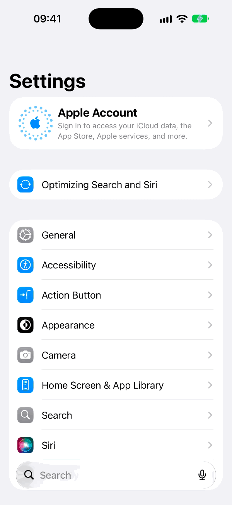

# Recording

SimMirror records a device's screen -- a simulator's or a [real device's](real-devices.md) -- as an MP4, an animated GIF
or both, with each touch drawn where it landed: the agent's and a person's. A person records from the viewer, an agent
with `sim_record`, and a terminal with `sim-mirror record`; all three record the same way and keep the files in the
same folder.



## From the viewer

The **Record** button in the toolbar starts a recording; it turns into a stop button and the bar counts the time
(`REC 1:12`). Stopping keeps it, and a note over the screen offers each file kept to save. A recording an agent started
shows there too, by whom, and a person may stop it. The button is there when the device's connector can be recorded
and the page's transport can ask.

## From an agent

`sim_record` takes an `action`:

- `start` -- with `format` (`mp4`, `gif` or `both`), `touches`, `speed` (`1`, `1.5`, `2` or `4`) and `status_bar`, each
  the setting's when left out;
- `stop` -- keeps it, and answers each file's path, size and pixel size;
- `status` -- whether the device is being recorded, for how long and by whom;
- `list` -- the recordings kept, newest first.

A recording stops by itself after `recording.max_seconds` and is kept.

## From a terminal

```sh
sim-mirror record start --format gif
sim-mirror record stop
sim-mirror record list
```

for this folder's project, or `--scope` another. The daemon records; the command asks it to.

## What is kept

A simulator is recorded by `simctl io recordVideo`; a real device from the screen SimMirror shows, which over the cable
is the live screen. SimMirror's native helper then renders it with the Mac's own frameworks -- AVFoundation,
VideoToolbox and ImageIO, no ffmpeg:

- **MP4**, H.264 or HEVC (`recording.codec`), sped up when asked;
- **GIF**, `recording.gif_width` wide at `recording.gif_fps`, with frames that do not change merged;
- **touches**: a ring where each tap landed and a trail along each swipe, unless `recording.touches` is off;
- **a demo status bar** -- 9:41, full signal and battery -- while recording, where the device can take one
  (`recording.status_bar`); its own status bar comes back after. A real device's cable screen already shows 9:41.

A simulator's recording that the helper cannot render is kept as recorded, without its touches, and says so; a real
device's needs the helper. Measured (2026-09-29): 10.8 seconds of an iPhone 14 Pro over its cable kept as a 900×1952
MP4 of 4.3 MB and a 600-pixel GIF of 2.0 MB.

Files are named for when they began, in your time, and the device: `20260929-034515-andrew-s-iphone.mp4`.

## Privacy

A recording shows whatever was on the screen. They are kept in `recording.folder` -- SimMirror in your Movies folder
when it is empty -- which only you can open (0700), each file readable only by you (0600). The oldest go once there are
more than `recording.keep`. `recording.folder` is [sensitive](settings.md#sensitive-settings): a page cannot move it
without a code from the terminal. The viewer's download reads a file only by its name, and only from that folder.

## Put a demo in a pull request

1. Record the flow as a GIF, or both: `sim_record` `start` with `format: "gif"`, the steps, `stop`.
2. **A GIF of 3 MB or less** can be committed beside the docs that show it (`docs/media/`) and linked from the pull
   request.
3. **Anything else** has to be uploaded into GitHub's comment box, which `gh` cannot do: open the pull request in a
   browser and drag the file into its description or a comment -- an agent with a browser tool can use its file upload
   -- then save. GitHub keeps an image up to 10 MB inline; a video's limit depends on your plan.

## Settings

The settings panel's **Recording** tab: `recording.folder`, `format`, `codec`, `max_seconds`, `touches`, `speed`,
`gif_fps`, `gif_width`, `status_bar` and `keep`. See the [configuration reference](reference/configuration.md).
