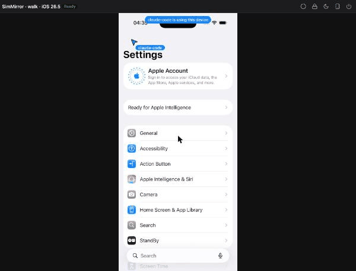
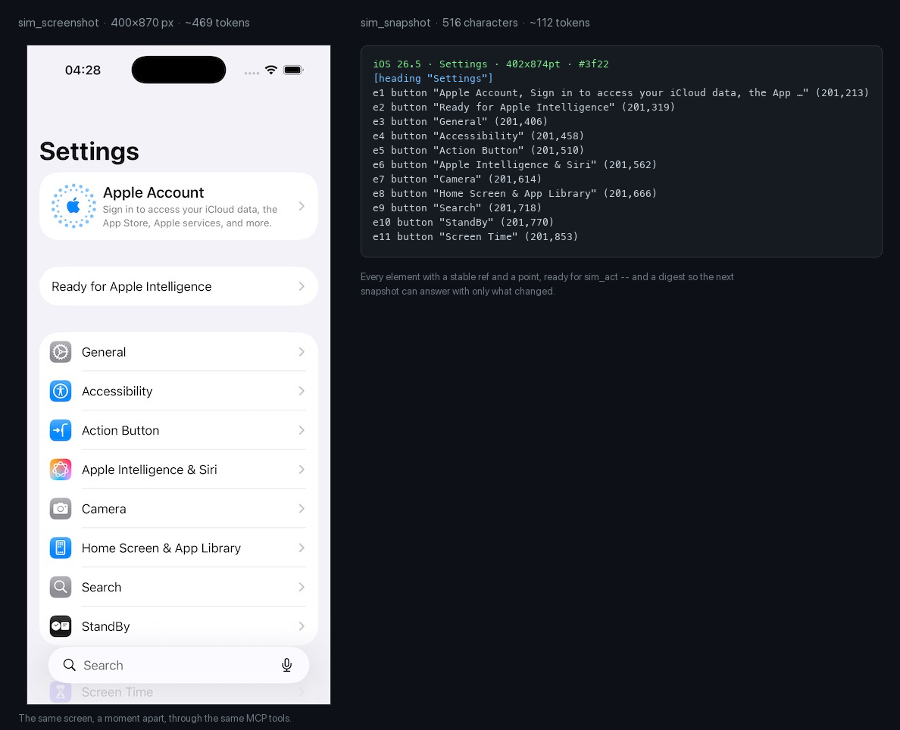

# Screen understanding

An agent needs to know what is on the screen, and every token it reads costs time and money. SimMirror gives it the
screen as a few short lines of text, and a screenshot only when a question is visual.

## A snapshot

`sim_snapshot` on the Settings app answers:

```
iOS 26.5 · Settings · 402x874pt · #bb14
[heading "Settings"]
e1 button "Apple Account, Sign in to access your iCloud data, the App …" (201,213)
e2 button "General" (201,319)
e3 button "Accessibility" (201,371)
e4 button "Action Button" (201,423)
e5 button "Apple Intelligence & Siri" (201,475)
e6 button "Camera" (201,527)
e7 button "Home Screen & App Library" (201,579)
e8 button "Search" (201,631)
e9 button "StandBy" (201,683)
e10 button "Screen Time" (201,770)
e11 button "Passcode" (201,853)
e12 search ="Search" (201,822)
e13 button "Dictate" (344,822)
```

- **The first line** is the runtime, the app, the screen's size in points, and the **digest** (`#bb14`), which changes
  whenever what the screen says changes.
- **One line per element** that can be acted on or says where things are -- buttons, fields, switches, cells, text,
  headings. Containers that only hold others are left out, and so is anything wholly off screen. A label longer than
  60 characters is cut with `…`.
- **A ref** (`e2`) names an element across snapshots.
- **The point** after it is where a tap lands: the middle of the part of the element that is on screen.
- At most `agent.snapshot_max_elements` lines (120 by default).

The source is the device's accessibility tree, read by the native helper or idb_companion, so an app whose controls have accessibility labels reads
best. A screen accessibility says nothing about is [read from its pixels](#read-from-pixels) instead.

## Refs

A ref stays with its element for as long as the element is on screen -- the same kind, label and identifier -- even
after it moved, so an agent can snapshot, scroll, and still tap `e2` where `e2` is now. A ref is never given to a
different element later. When one of several elements that look the same is added or removed, all of them get fresh
refs: a ref an agent kept for one of them is refused as not on screen, never landing on its neighbour.

## Diffs

`sim_snapshot` with `mode: "diff"` (the default) gives only what changed since this agent last looked:

```
#bb14 → #7ba8
~ e2 button "General" (201,419)
- e6 button "Camera" (201,527)
```

`+` is an element that appeared, `-` one that went, and `~` one that moved or changed. When most of the screen changed
-- a new screen, a long scroll -- the whole screen reads better than a list of everything that moved, so the diff gives
the whole screen instead.

## Read from pixels

A game, a canvas, an app still loading, an app whose accessibility stopped answering, or a device shown through a
connector that reads no tree at all (simctl) still shows text. When the tree says nothing, a snapshot reads the text in
the screen's pixels with macOS's Vision:

```
iOS 26.5 · 402x874pt · #6af8
e1 text "Sign in" (200,410)
e2 text "Forgot password?" (200,470)
accessibility said nothing on this screen, so its pixels were read -- if the app has controls, its accessibility may have stopped answering, as it can after UI tests: sim_device restart brings it back
2 lines were read from the screen's pixels: text may be misread, and a ref taps its middle
```

- **Each line of text is a `text` element with a ref**, so `{"tap": "e1"}` taps the middle of "Sign in" and
  `{"for": "Sign in"}` waits for it.
- **`perception.ocr` says when.** `fallback` (the default) reads pixels only when the tree says nothing, and lets a
  device whose connector reads no tree be read at all. `merge` reads them on every snapshot and adds the text the tree
  leaves out, as [Xcode's hierarchy](connectors.md#merging-xcodes-hierarchy) does -- 0.3 to 1 second more each. `off`
  never reads them.
- **How it reads** is the scope's too: `perception.ocr_level` (`accurate`, or `fast`), `perception.ocr_languages`
  (codes such as `en-US, uk-UA`; empty to detect them), `perception.ocr_correction`, `perception.ocr_min_confidence` and
  `perception.ocr_timeout_ms` -- all in the settings panel's **Screen reading** tab.
- **The reader is SimMirror's own**: a small Swift helper it compiles with the scope's Xcode the first time a screen is
  read, and keeps under its state folder until a new SimMirror or a new Xcode compiles it again. `sim-mirror doctor`
  compiles it and reads a test picture. Measured on macOS 26.6 (2026-09-17): the first compile took 6 to 7 seconds with
  Xcode 26.6 and with 27.0; an 804x1748 screenshot then read in 0.44 seconds at `accurate` and 0.05 at `fast`.
- **A screen that did not change is not read again**, and reads the same, refs included.

### Seeing what was read

With **`perception.ocr_overlay`** on, the viewer outlines each line a reading found -- dashed where it was unsure -- and
pointing at a box says what it reads and how sure. The boxes go when they no longer hold: before an agent's gesture,
when a person touches the screen, and when a snapshot reads the screen without its pixels. Like the agent's cursor, they
are drawn by the viewer over the screen, so no screenshot or recording of the device shows them.

## Acting: `sim_act`



Every step is announced before it lands and drawn where it will land, so anyone watching sees what is coming.

One call plays a batch of up to 20 steps, because a round trip is what an agent pays for, not a gesture:

```json
{
  "steps": [
    {"tap": "e2"},
    {"swipe": {"from": [201, 600], "direction": "up"}},
    {"type": "Groceries", "into": "e7", "clear": true, "submit": true},
    {"press": "home"}
  ],
  "wait": {"for": "Saved"}
}
```

- Steps: `tap`, `long_press`, `swipe`, `drag`, `type`, `press`, `pause`. A target is a ref or a point `[x, y]`.
- **Waits** after the steps: `{"for": text}` until text appears, `{"gone": text}` until it goes, or
  `{"settle_ms": ms}` until the screen stops moving; each takes an optional `timeout_ms`. A focused field's blinking
  caret does not count as moving.
- **Settling survives animations that never stop.** A settle wait compares a coarse grid of the screen's brightness
  with the look its quiet time began with (`perception.settle`: `perceptual`, the default). Small places that keep
  changing look after look -- a spinner, a pulsing dot, a shimmer -- are noticed and no longer watched, and the answer
  says so: `settled after 450ms (3 small places kept moving and were not watched)`. A label that changes once or a row
  that appears still starts the quiet time again, and a slow fade is not taken for stillness. Text inside a place that
  kept moving -- an animated "Saving…" -- is not watched either, so wait `{"for": "Saved"}` there.
  `perception.settle_tolerance` and `perception.settle_grid` tune it; `exact` waits until not one byte of a screenshot
  changes, as SimMirror 1.0 did.
- **The answer** says ok or why not for each step, then what changed on screen as a diff. A step that cannot be played
  -- a ref whose element is gone -- ends the batch; the steps before it stay done.
- **Every gesture is announced before it lands**: viewers draw the agent's cursor moving there first. **A person comes
  first**: agents wait for a person's hand to be still before a gesture, and take turns with each other.
- **The cursor stays while the agent works**: it rests, dimmed, where the agent last acted -- through the agent's
  thinking, a build or a test run -- and leaves `agent.cursor_linger_s` (60 seconds) after its last tool call; `0` lets
  it go once each gesture is drawn. It is the viewer's own, drawn over the screen: `sim_screenshot`, snapshots and
  anything recorded from the device never contain it.

## Screenshots: `sim_screenshot`

For what text cannot tell: colour, layout, an image, an animation.

- `width` -- 160 to 1200 pixels; `agent.screenshot_width` (400) by default, which is plenty to judge a layout.
- `region` -- a ref or `{x, y, w, h}` in points, to see one part.
- `frames` (up to 6) `interval_ms` apart, to see something move.

## What it costs

Tools estimate what an answer costs an agent -- text at about 4 characters a token, an image at about 750 pixels a
token. Models count their own way, so these are estimates, for comparing answers with each other.



Measured on the screen above: the snapshot is 516 characters -- about 112 tokens -- against about 469 for a
400-pixel-wide screenshot of it, and about 4181 for a 1200-pixel one. A diff of a screen that has not changed is
83 characters.

Measured through the MCP relay on Settings → General (iPhone 17 Pro simulator, iOS 26.5, idb, 5 calls each,
2026-09-16): a full snapshot answered in 561 bytes, about 112 tokens (p50 65 ms); a diff of an unchanged screen in
83 bytes, about 5 tokens; a 400-pixel-wide screenshot in 62 KB, about 469 tokens (p50 8 ms); a 1200-pixel-wide one
in 276 KB, about 4181 tokens. Measure your own screens with [the token budget example](../examples/token-budget/).

## The loop agents are taught

1. `sim_snapshot` to read.
2. `sim_act` with every step already known, and a wait.
3. Read the diff it answers with; act again.
4. `sim_screenshot` only to check how something looks.

The MCP instructions and the Claude Code plugin's skill both teach it.

## What comes next

The element tree comes from a `TreeReader`: the accessibility tree the native helper or idb_companion reads, Xcode 27's UI hierarchy through
`mcpbridge`, or the text in the screen's pixels. Readers merge -- the first one's tree whole, each later one adding only
what the ones before did not say in the same place -- or fall back, a later one read only when the ones before read
nothing. Xcode's hierarchy can already be [merged into idb's](connectors.md#merging-xcodes-hierarchy), for the text and
links of a web page, and pixels read when nothing else can. Planned readers merge in more -- a WebDriverAgent source tree
on real devices, an in-app debug hierarchy for SwiftUI and UIKit views without accessibility labels. See the
[roadmap](../ROADMAP.md).
