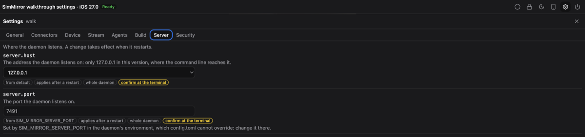

# The settings panel

```sh
sim-mirror open --settings
```

opens a project's simulator in a browser tab with its settings a click away: the gear in the viewer's toolbar opens a
panel with a tab for each section of `config.toml` -- General, Connectors, Device, Stream, Agents, Build, Server and
Security. It edits the same file `sim-mirror config set` does, keeping its comments, and the daemon acts on a change
before the panel says it is saved.



## Changing a setting

Change any values in a tab and choose **Save**. A tab is saved as one change: all of it is written, or none of it and
each setting's problem is shown beside it.

- **This project** writes the project's own `[scopes."<project>"]` table; **Every project** writes the top of the file.
  The Server and Security tabs are always for the whole daemon, which is the only place those settings are read.
- **Reset** puts a value back to what applies without it, from wherever it was set.
- Each setting says where its value comes from (the default, `config.toml`, this project, or a `SIM_MIRROR_*`
  variable) and, when a change does not apply at once, when it does: on a viewer's next connection, on the next device
  brought up, or after the daemon restarts.

## What the panel cannot change

- **A value a variable or the command line sets.** `SIM_MIRROR_STREAM_QUALITY` in the daemon's environment wins over
  `config.toml`, so the panel shows it, disabled, and says where to change it.
- **Nothing, from a plain viewer.** `sim-mirror open` without `--settings` shows the settings and changes none of them.
  A settings session lasts an hour; open it again with `--settings` after that.
- **Nothing, in a frame.** An iframe or a host's page never shows the gear.

## Sensitive settings

Seven settings decide what SimMirror runs or who may reach it:
`connectors.idb.companion_path`, `device.developer_dir`, `build.tools`, `server.host`, `server.port`,
`security.allowed_origins` and `security.frame_ancestors`. A web page is not trusted with those alone, so saving a
change to one asks for a code:

1. The panel says the change is waiting.
2. In a terminal, run

   ```sh
   sim-mirror settings confirm
   ```

   It shows each waiting change as it would be written -- `walk: build.tools = true` -- and its code.
3. If it is the change you asked for, type the code into the panel and choose **Confirm**.

A code confirms that change and no other, works once, lasts five minutes, and stops working after five wrong tries.
`sim-mirror config set` changes these settings directly, as it always has.

## In a host application

The panel appears wherever the viewer's transport can read settings. A Python host that wants it mounts
`create_settings_router` with a settings store and authenticator of its own; one that keeps its own settings screens
mounts nothing and the gear never shows. See [A Python host application](embedding/python-fastapi.md#settings).
